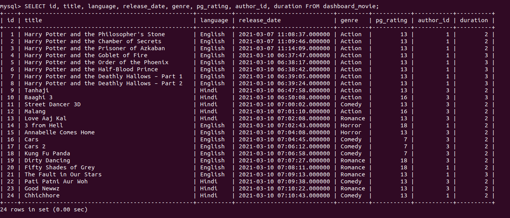

# Movie_Management_System

This is a project made for Database Systems Lab course. 

## To run:  

- Ensure you have MySQL and Python3 installed.
- Run the following:
```
pip install -r requirements.txt
python manage.py migrate
python manage.py runserver
```
- Then visit [127.0.0.1:8000/](127.0.0.1:8000/)

# Screenshots

  
  
  
  
 
