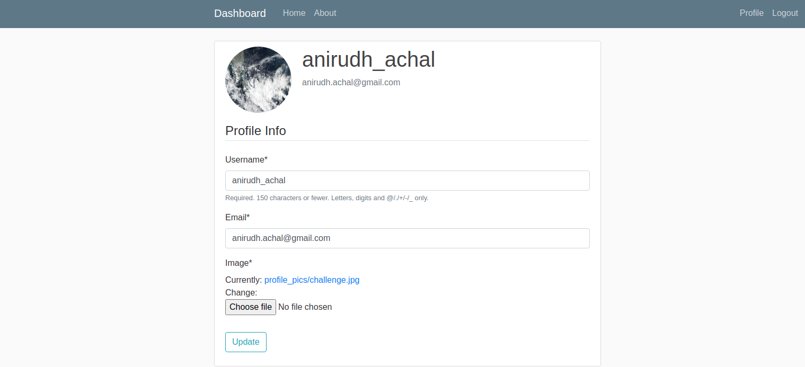
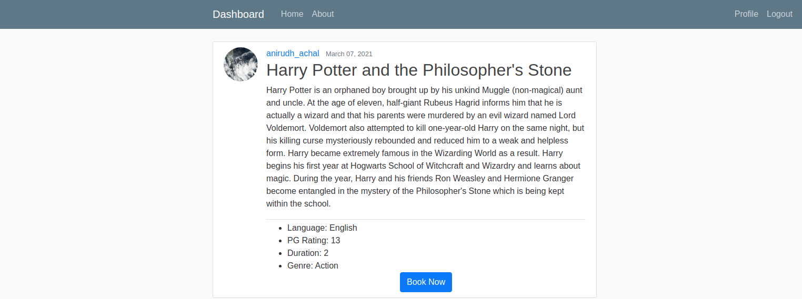
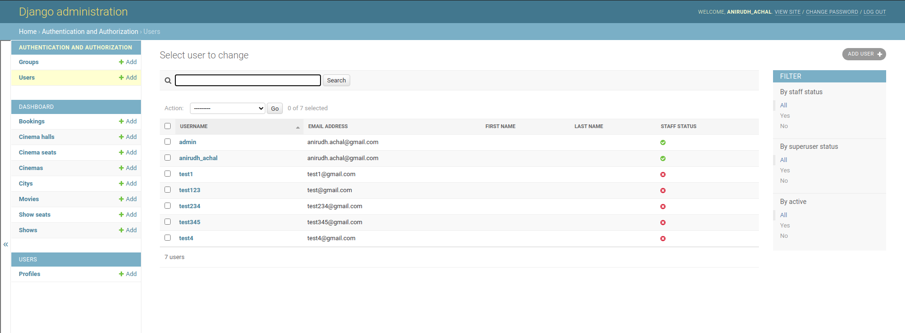
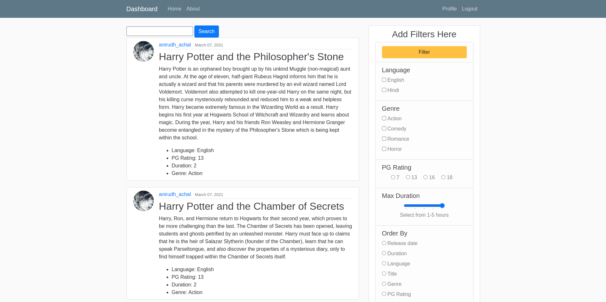
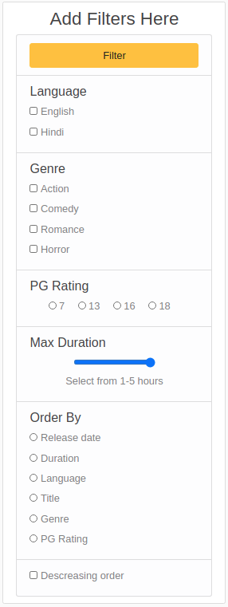

# Movie_Management_System

This is a project made for Database Systems Lab course. 

Team Members

1) Nanda Kishore - 191CS140
2) Anirudh Achal - 191CS108
3) Rakshit P - 191CS147

## To run:  

- Ensure you have MySQL and Python3 installed.
- Run the following:
```
pip install -r requirements.txt
python manage.py migrate
python manage.py runserver
```
- Then visit [127.0.0.1:8000/](127.0.0.1:8000/)

# Screenshots

## Profile



## Movie Page



## Admin Panel



## Movie Dashboard



## Login Page

 

## Filters



## Booking Page


## User Bookings


