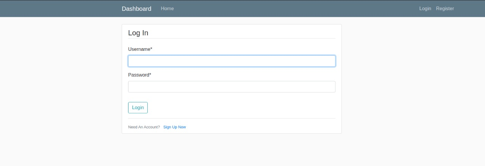
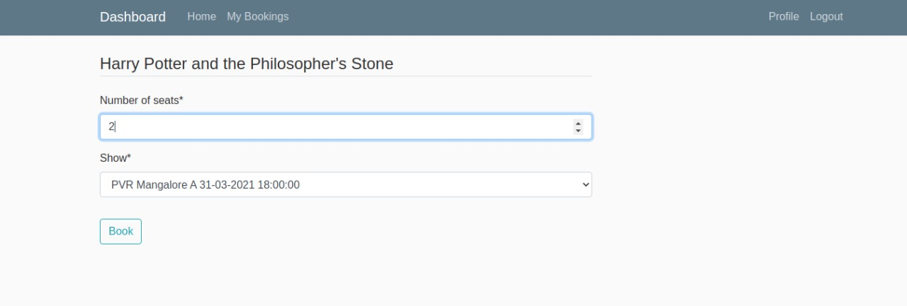
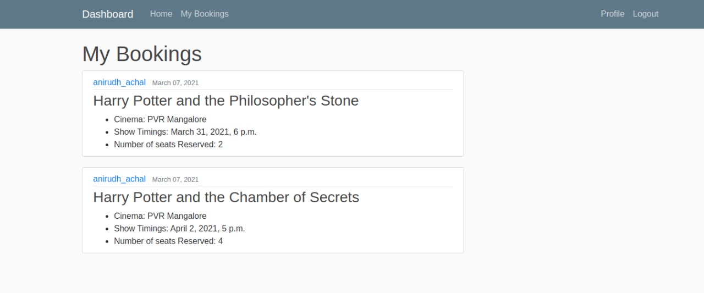

# Movie Management System

Movie Management System is a web application built using Django along with MySQL database, which allows users to filter, view and making reservations for various different movies. This is a project made for Database Systems Lab course. Full details regarding schema and features can be found in the project report.

Team Members

1) Nanda Kishore - 191CS140
2) Anirudh Achal - 191CS108
3) Rakshit P - 191CS147

# Instructions 

- Ensure you have MySQL and Python3 installed.
- Run the following:
```
pip install -r requirements.txt
python manage.py migrate
python manage.py runserver
```
- Then visit [127.0.0.1:8000/](127.0.0.1:8000/)

# Tech Stack 
- Frontend : HTML, CSS and JavaScript
- Backend : Django
- Database : MySQL 

# Screenshots

## Profile


## Movie Page


## Admin Panel


## Movie Dashboard


## Login Page

 

## Filters


## Booking Page



## User Bookings


